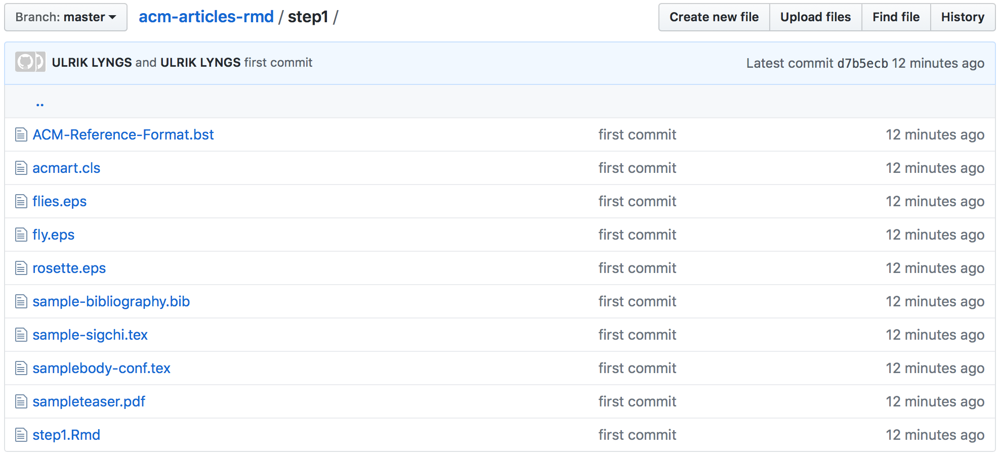
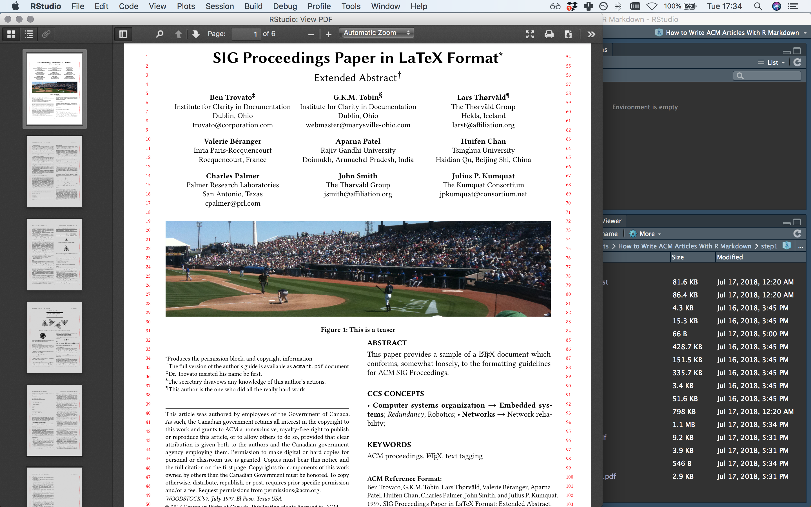
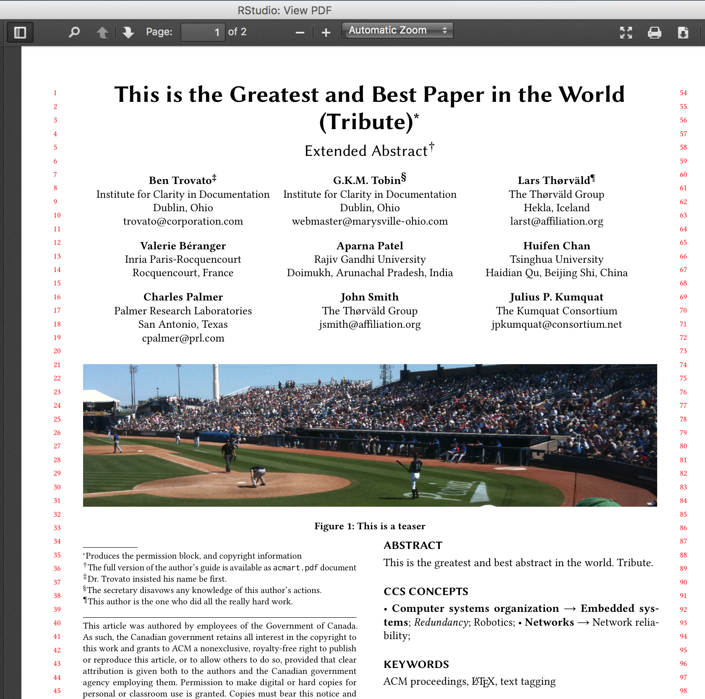
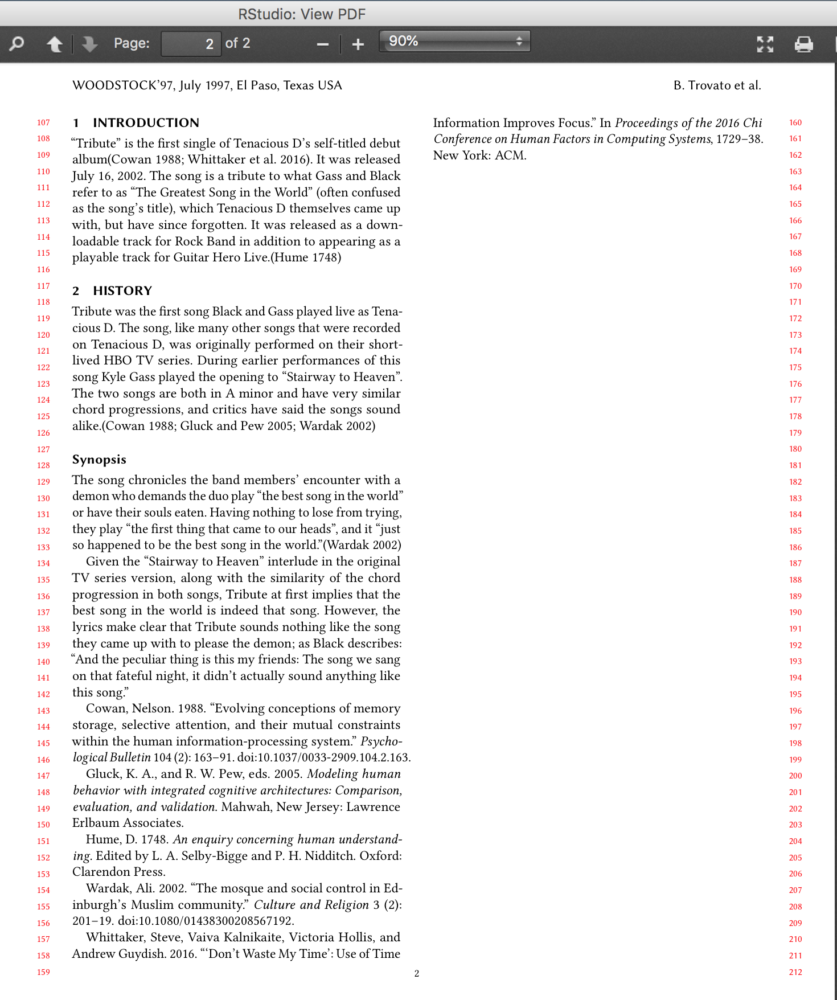
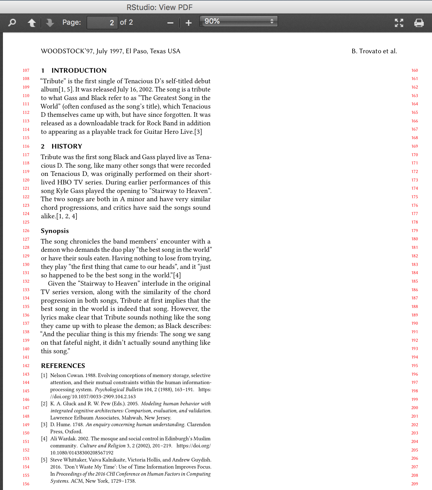
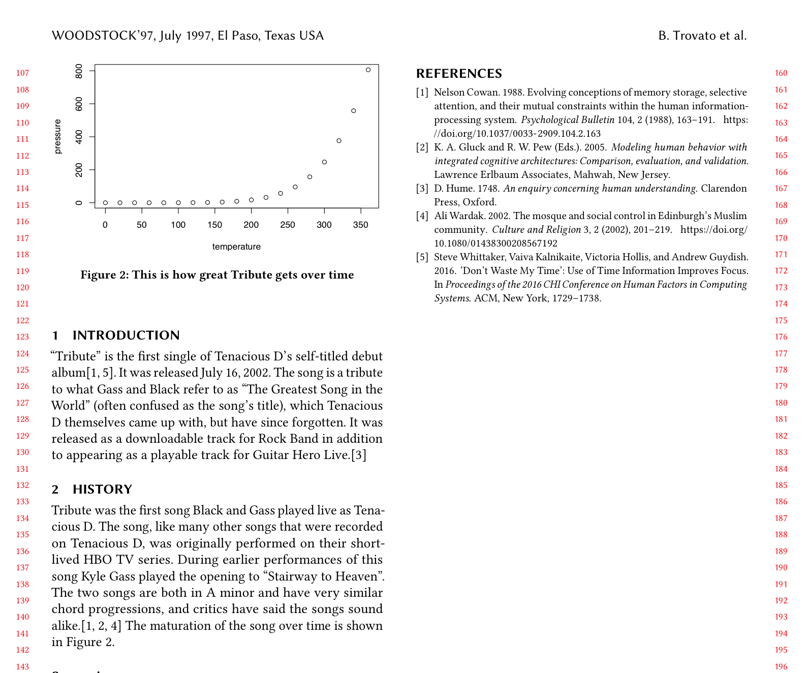

# How to Write ACM Articles With R Markdown

I love [R Markdown] (https://bookdown.org/yihui/rmarkdown/). I use R for almost all my data analyses and visualisations these days, and R Markdown documents helps me keep a kind of interactive lab notebook that reminds me of the steps I took - and why - and makes it quick and easy to reproduce everything.

Like many others (e.g. [here] (https://rosannavanhespenresearch.wordpress.com/2016/02/03/writing-your-thesis-with-r-markdown-1-getting-started/), [here] (https://eddjberry.netlify.com/post/writing-your-thesis-with-bookdown/), and [here] (https://github.com/benmarwick/huskydown)), I too am planning to write my entire PhD thesis in R Markdown. The benefits are obvious, as other blog posts and online publications have already pointed out: First, you reduce the risk of mistakes by doing your academic write-up in the very same file as you use to produce the analysis outputs - when you update analysis code, the output plots are automatically updated too (this [wonderful YouTube video] (https://youtu.be/s3JldKoA0zw) will remind you that this is important and how awesome you will feel when you do things write). Second, you save yourself effort if you e.g. want to publish your thesis as an ebook or physical book afterwards, or if you usually write in LaTeX but collaborate with MS Word users: From the same R Markdown file, you can export to the format you need. 

So, like many others (this [blog post by Colin Bousige] (https://colinbousige.github.io/post/rmarkdown/) I found especially helpful!), I want to transition entirely to writing in R Markdown also when writing submissions to academic conferences and journals.

In my research group, one of the most important outlets for our work is ACM CHI (Conference on Human Factors in Computing Systems). However, I ended up spending several frustrated hours wrapping my head around how to use the ACM LaTeX template properly. RStudio has made the `rticles` package which is meant to include templates for writing R Markdown documents formatted to the submission standards of loads or academic journals and conferences, including a [generic ACM template] (https://github.com/rstudio/rticles/tree/master/inst/rmarkdown/templates/acm_article). However, it was not obvious to me how the exact templates were arrived at (many are crowd-contributed and does not seem to come with any documentation for the individual templates), and the outputted result didn't seem to correspond exactly to the usual official ACM LaTeX templates anyway!

Besides, for the next CHI conference, it turns out the ACM just updated the templates (at the time of writing, the last update to the master templates happened on July 17, 2018, i.e. today!). So the question remains: **What is the route of least effort for using R Markdown to write articles for CHI?**

Turns out the answer is very simple, but it took me way longer to figure out that it should have done, as I couldn't really find the right advice anywhere. **Here's how to do it:**

## Step 1. Understand how to use (the ACM) LaTeX template with R Markdown
So first things first. In order to use the ACM template, we'd download the latest version [from here] (https://www.acm.org/publications/proceedings-template) - but for the purposes of this tutorial, clone or download [this GitHub repo] (https://github.com/ulyngs/acm-articles-rmd). Then open the R Project file in the 'step1' folder.



This folder contains the essential files to make the sigchi proceedings template work (it's just a subset of the files in the acmart-master folder that you can download on the ACM page linked to above):
- acmart.cls provides the LaTeX class for the new ACM master template
- ACM-Reference-Format.bst provides the bibliography formatting
- sample-sigchi.tex provides the LaTeX template for sigchi-proceedings (as you can read in the documentation in acmart.phf, you just change the article format in this LaTeX template in order to output a format for e.g. sigchi-extended abstracts rather than the proceedings format)
- all the other files are just there to provide the sample content that's shown by default in the template - images (files.eps, fly.eps, rosette.eps, and sampleteaser.pdf), bibliography (sample-bibliography.bib), and sample content (samplebody-conf.tex)

Now, as you will see if you open step1.Rmd, the only thing we need to include in the r markdown file to use the CHI template is the following YAML header:

```
---
output:
	bookdown::pdf_book:
		template: sample-sigchi.tex
---
```

(Note that I use `bookdown::pdf_book:` here instead of simply `pdf_document` because bookdown extends the referencing capability of R Markdown, so that we can reference figures in a way that can be exported to also interactive ebook formats rather than only to LaTeX.)

If you click 'Knit', the CHI proceedings template with sample content should compile correctly:


## Step 2. Adjust the LaTeX template to include your content
Ok, so now we know how to compile to an arbitrary template without putting in any content. What we need to know now is how to automatically put in the content we write in R Markdown.

To do that, we need to know that [pandoc](https://pandoc.org), when compiling from R Markdown to LaTeX, treats text put in $between dollar signs$ in the LaTeX template as a variable to go find in the R Markdown file.

So, for example, if I in sample-sigchi.tex change `\title{SIG Proceedings Paper in LaTeX Format}` to `\title{$title$}`, then pandoc will go look for a variable `title` in the YAML header of the R Markdown file and plug that in to the LaTeX template.

So here we have a choice: We could go all the way and put *all of the meta data and random LaTeX settings for the paper into the YAML header*, kinda like what I think is the idea behind the ['rticles' package](https://github.com/rstudio/rticles). 

I started doing this, but concluded that **this is a terrible idea**, because we then must keep on top of the detail of all changes that might be made in the future to the ACM LaTeX template. Rather, the route of least effort is to only make **minimal changes** that allow us to plug in the body text from the R Markdown document, so that we can reuse the hard work we put in to writing this body text in the R Markdown format when we output it elsewhere. If the ACM LaTeX template changes in the future, then we'll just make these minimal changes again to make it work.

I concluded that the route of least effort is the following:
1. Plug in paper title from the YAML header. (explained above; in the Rmd file we will add something like this to the YAML header: `title: This is the Greatest and Best Paper in the World (Tribute)`
2. Plug in bibliography file from the YAML header (in sample-sigchi.tex, after `\bibliographystyle` change `\bibliography{sample-bibliography}` to `$bibliography$`. Then add something like `bibliography: my-bibliography.bib` to the YAML header of your Rmd file.)
3. Plug in abstract from the Rmd file (in sample-sigchi.tex, replace the text in between `\begin{abstract}` and `\end{abstract}` with simply `$abstract$`. Then add something like `abstract: This is the greatest and best abstract in the world. Tribute.` to your YAML header.)
4. Plug in paper content from the Rmd file (in sample-sigchi.tex, after `\maketitle` change `\input{samplebody-conf}` to `$body$`. This will make pandoc plug in any content after the YAML header into this section)

All other metadata (author names, whether you need title notes, etc.) we will just set directly in sample-sigchi.tex - it's not worth the effort (I think) to set up variables in your YAML header for this.

Let's see what we get when we knit the result:


Ok, so title and abstract is plugged in correctly from the YAML header. Let's look at page 2:


Argh! The body content as a whole is input correctly, but the in-text citations are not quite formatted the way we want, nor is the reference list shown in that nice ACM style. What's going on?

If we add `keep_tex: true` in the YAML header, indented under `bookdown::pdf_document:`, then we can knit again and inspect the intermediary .tex file that the PDF is generated from.

Ahh, now things make sense. In the .tex file, we see that with our current settings, the citations and the references have been plugged in as plain text, instead of using the appropriate LaTeX commands:
```
It was released as a downloadable track for Rock Band in addition to appearing as a playable track for Guitar Hero Live.(Hume 1748)

...

\hypertarget{ref-Hume1748}{}
Hume, D. 1748. \emph{An enquiry concerning human understanding}. Edited by L. A. Selby-Bigge and P. H. Nidditch. Oxford: Clarendon Press.
```

Not quite what we want! Let's fix this.

## Step 3. Make sure citations are shown correctly
Turns out this is easy. Go to the YAML header and under `bookdown::pdf_book:` add (with indentation) `citation_package: natbib`. This will make use of the LaTeX natbib package to insert the citations into the .tex, instead of inserting them as plain text. Let's knit again to see if it worked:



Yup, it looks right. Let's have a look at the .tex to see what's actually going on:
```
It was released as a downloadable track for Rock Band in addition to appearing as a playable track for Guitar Hero Live.\citep{Hume1748}
```

So the citations are now correctly inserted with `\citep{citation-key}`, and the bibliography is being generated by LaTeX via the final calls to `\bibliographystyle{ACM-Reference-Format}` and `\bibliography{my-bibliography}`. Success!

## Step 4. Handling figures
Let's get to the fun stuff. We want our plots to be generated straight from R and put automatically into our article, right? 

First, in our YAML header add `fig_caption: true` under `bookdown::pdf_book`. This makes sure that our plots and figures are put in a figure environment, and gives us more control over the options of this environment. 

Then, in our body text after the 'History' paragraph, add the following chunk of R code:

````
```
{r tribute-plot, echo=FALSE, out.width='0.98\\columnwidth', fig.cap="This is a column-width plot of how great Tribute gets over time"}
plot(pressure)
```
````

For new initiates, ` ``` ` means we want a code chunk, the chunk options are in between `{ }`. The `r` means this is R code, `tribute-plot` is the figure label, `echo=FALSE` says we don't want to output the code itself, only its output, `out.width='0.98\\columnwidth'` says we want to restrict the size of the plot to 98% of the width of a column (if you try without this option, you'll see that the plot gets way too big; note that we must escape the `\` with another `\`), and `fig.cap=` is followed by the figure caption.

If we knit and inspect the generated .tex file, we see that this chunk was translated into this:

```
\begin{figure}
	\includegraphics[width=0.98\columnwidth]{step4_files/figure-latex/col-width-tribute-plot-1} 
	\caption{This is how great Tribute gets over time}
	\label{fig:col-width-tribute-plot}
\end{figure}
```

I.e. R Markdown generates the plot, creates a subfolder and saves the plot in there, then includes this generated plot in the .tex file. Magic! (Not to mention **crucial steps to automate to avoid errors in the research process**!)

And the output looks as we'd expect:


### Two-column figures
The acm-article template also tells us that to include a figure that spans two columns, we want to put it in a `figure*` environment rather than simply a `figure` environment. How do we do this? Easy, we just add `fig.env='figure*'` to the chunk options:

````
```
{r two-col-tribute-plot, echo=FALSE, out.width='0.98\\textwidth', fig.cap="This is a two-column plot of how great Tribute gets over time", fig.env='figure*'}
plot(pressure)
```
````

(Note also that I updated the output width to `out.width='0.98\\textwidth`; otherwise the plot width would've still been only 98% of a column even though it was spanning two columns.)

If we inspect the .tex file, we can see that this, as we'd expect, is translated in to this corresponding LaTeX:

```
\begin{figure*}
	\includegraphics[width=0.98\textwidth]{step4_files/figure-latex/two-col-tribute-plot-1} 
	\caption{This is a two-column plot of how great Tribute gets over time}
	\label{fig:two-col-tribute-plot}
\end{figure*}
```

And the output again looks correct (it's floating to a new page in our case):


## Step 5. Handling tables

## Step 6. Referencing our figures and tables

## Step 6. Celebrate!

